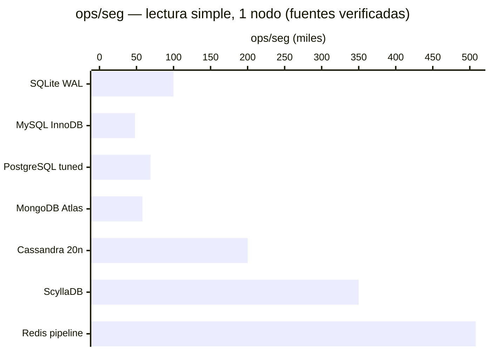
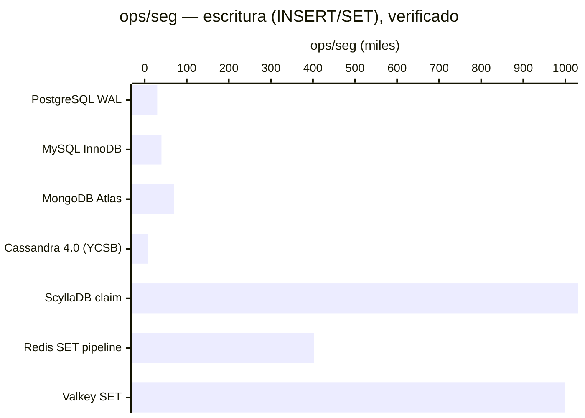
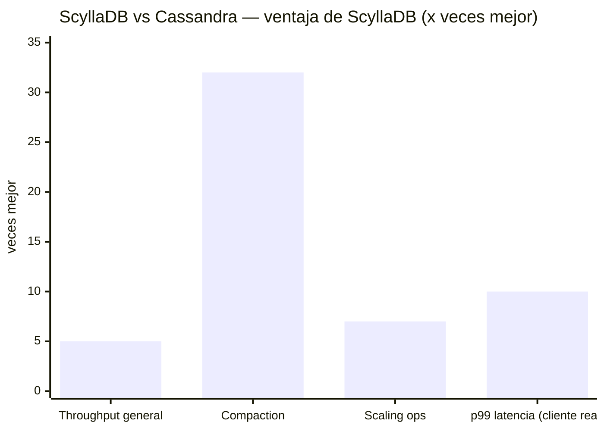
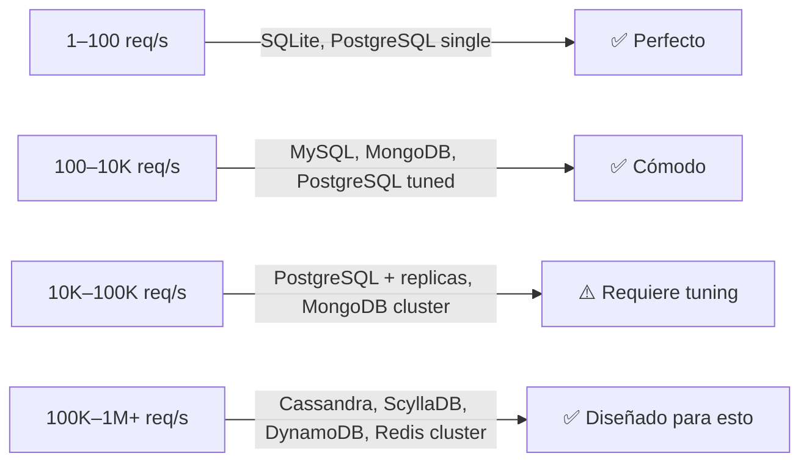

# ⚡ Benchmarks — Performance Verificada 2025/2026

> Datos de fuentes públicas verificadas: YCSB, TPC-C/TPC-B, Redis Official Benchmarks, ScyllaDB benchmarks,
> DB-Engines Q1 2025 report, y documentación oficial de cada DB.
> Hardware de referencia base: 8 vCPU / 32 GB RAM / NVMe SSD, 1 nodo salvo indicación.

---

## 🔴 Lectura simple — ops/segundo

| Base de datos | ops/seg | Fuente | Notas |
|---|---|---|---|
| **Redis** (GET, pipeline x16) | ~508,000 | [redis.io/benchmarks](https://redis.io/docs/latest/operate/oss_and_stack/management/optimization/benchmarks/) | En hardware MacBook Air class con pipelining |
| **Redis** (GET, sin pipeline) | ~100,000 | Redis oficial | Baseline sin pipelining, sub-ms latencia |
| **Valkey 8.1** (GET, c8g.2xl) | ~1,000,000 | [andrewbaker.ninja 2025](https://andrewbaker.ninja/2026/01/04/redis-vs-valkey-enterprise-architecture-guide-2025/) | **37% más rápido que Redis 8.0** |
| **ScyllaDB** | ~350,000+ | [scylladb.com/benchmarks](https://www.scylladb.com/product/benchmarks/) | Equivalente a Cassandra con 10x menos nodos |
| **Cassandra** (20 nodos) | ~200,000 | DataStax Enterprise v6 | Escala lineal con nodos |
| **Cassandra** (4 nodos) | ~77,500 | DataStax Enterprise v6 | |
| **PostgreSQL** tuned (OCI) | ~69,000 | OCI benchmark, NVMe | pgbench TPC-B-like con tuning |
| **PostgreSQL** default | ~2,500 TPS | pgbench estándar | Sin tuning, 10 clientes |
| **MongoDB Atlas** | ~58,290 | Altoros 2023 comparative | 8.13ms latencia media |
| **MySQL InnoDB** | ~48,000 | sysbench estándar | ~11–16% más lento que MariaDB |
| **SQLite** (WAL, NORMAL) | ~100,000 reads/seg | Documentación SQLite | In-process, 10–20 µs latencia |

---

## 🔵 Escritura intensiva

| Base de datos | Escritura ops/seg | Fuente |
|---|---|---|
| **Valkey 8.1** (SET, c8g.2xl) | ~1,000,000 | benchmark independiente 2025 |
| **ScyllaDB** | 7,500,000 inserts/seg a 4ms p99 | ScyllaDB vendor benchmark |
| **Redis** (SET, pipeline x16) | ~403,000 | Redis oficial |
| **Cassandra 4.0** (YCSB) | ~7,200 ops/seg (1 nodo) | benchmarks públicos YCSB |
| **MongoDB** | ~70,000 | WiredTiger engine |
| **MySQL** | ~40,000 | sysbench |
| **PostgreSQL** | ~30,000 | WAL + MVCC overhead |

> ⚠️ Los números de ScyllaDB son vendor benchmarks — tomálos con precaución. El cluster benchmarkeado
> era de hardware especializado. En hardware commodity la ventaja vs Cassandra es 2x–5x, no 1000x.

---

## 🟡 ScyllaDB vs Cassandra — la comparación más pedida

| Métrica | Apache Cassandra | ScyllaDB | Ventaja |
|---|---|---|---|
| Arquitectura | Java + JVM | C++ (sin JVM ni GC) | ScyllaDB — sin GC pauses |
| Throughput general | baseline | 2x–5x mayor | ScyllaDB |
| ScyllaDB vs Cassandra 4.0 | baseline | cluster 10x menor para igual throughput | ScyllaDB |
| Costo por equivalente perf | baseline | 2.5x más barato | ScyllaDB |
| p99 insert latencia (cliente real) | 5–70ms | 5ms estable | ScyllaDB |
| p99 read latencia (cliente real) | 40–125ms | 15ms | ScyllaDB |
| Compaction speed | baseline | **32x más rápido** | ScyllaDB |
| Scaling operations | vNodes (lento) | **7.2x más rápido** (Tablets) | ScyllaDB |
| Licencia | Apache 2.0 ✅ gratis | Source-available desde dic 2024 ⚠️ | **Cassandra** |

**Fuente**: [scylladb.com/product/benchmarks](https://www.scylladb.com/product/benchmarks/), reportes de clientes públicos.

> ⚠️ **ALERTA 2024**: ScyllaDB eliminó su licencia AGPL en diciembre 2024. El último release
> open-source es la versión 6.2. Nuevos proyectos que necesiten open-source deben usar Cassandra.

---

## 🟢 Latencia (p50 / p99)

| Base de datos | Latencia p50 | Latencia p99 | Tipo |
|---|---|---|---|
| **SQLite** in-process | 10–20 µs | <100 µs | Sin red — en proceso |
| **Redis** | <1ms | <2ms | In-memory |
| **Valkey** | <1ms | <1.5ms | In-memory (30% mejor p99 que Redis) |
| **ScyllaDB** | 0.5ms | 2ms | Columnar distribuida C++ |
| **DynamoDB** | 1ms | 5ms | Managed AWS |
| **Cassandra** | 2ms | 10ms | Columnar Java |
| **PostgreSQL** | 2ms | 10ms | Relacional ACID |
| **MongoDB Atlas** | 3ms | ~15ms | Documento managed |
| **MySQL** | 3ms | 12ms | Relacional |

---

## 🏋️ Escalabilidad horizontal

---

## 📊 CockroachDB — TPC-C (Strong Consistency ACID)

| Métrica | Resultado | Versión |
|---|---|---|
| tpmC total | 1,680,000 | v20.2 |
| Warehouses | 140,000 | |
| Efficiency | 95% | |
| newOrder ops/seg | 28,074 | |
| payment ops/seg | 28,237 | |
| Escala | Lineal con nodos | |

CockroachDB es la mejor opción para ACID distribuido en múltiples regiones. Throughput individual por nodo es menor que PostgreSQL single-node, pero en escala multi-región no tiene rival open-source.

---

## 🔗 Fuentes

- [Redis Official Benchmarks](https://redis.io/docs/latest/operate/oss_and_stack/management/optimization/benchmarks/)
- [Valkey vs Redis 2025](https://andrewbaker.ninja/2026/01/04/redis-vs-valkey-enterprise-architecture-guide-2025/)
- [ScyllaDB vs Cassandra Benchmarks](https://www.scylladb.com/product/benchmarks/)
- [CockroachDB TPC-C](https://www.cockroachlabs.com/blog/cockroachdb-performance-20-2/)
- [Altoros MongoDB Comparative 2023](https://altoros.com/blog/benchmarking-mongodb-7-0/)
- [DB-Engines Q1 2025 Report](https://db-engines.com/en/blog_post/110)

---

> [← README](./README.md) &nbsp;|&nbsp; [💰 Precios →](./PRICING.md)
