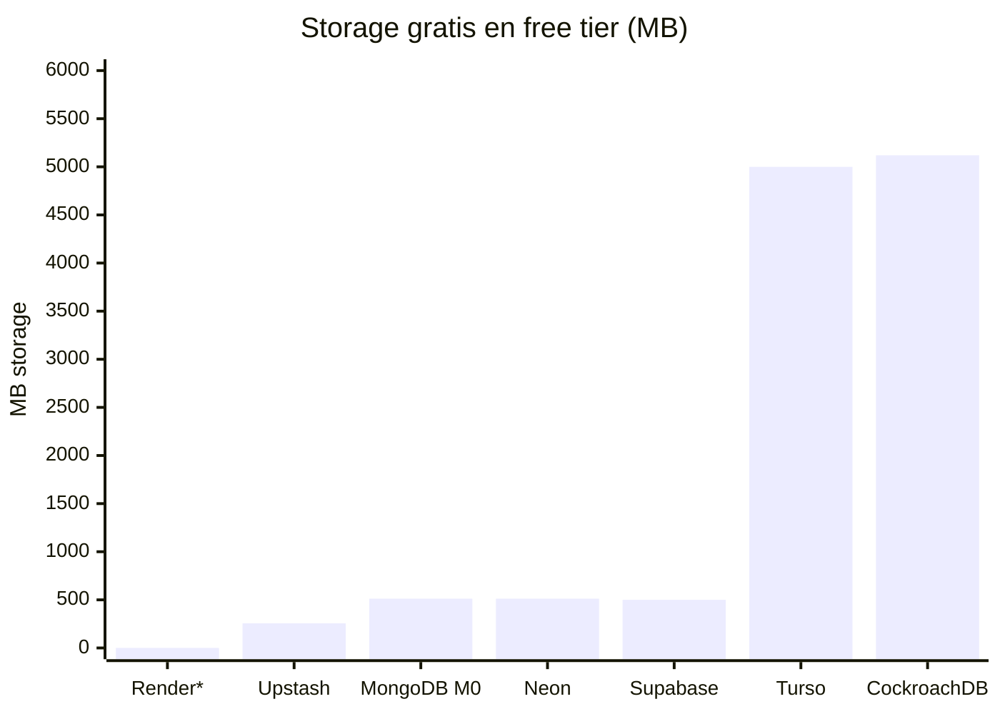
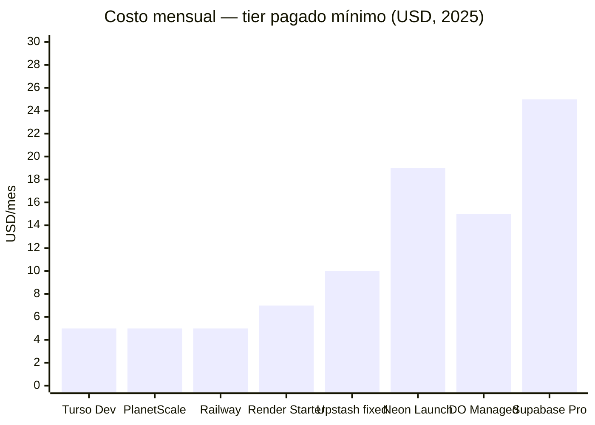
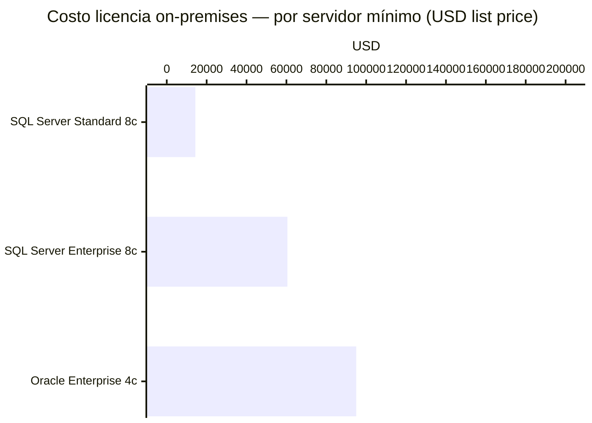

# 💰 Precios — Free Tiers, Más Baratas, Más Caras (2025/2026)

> Precios verificados. Última actualización: mayo 2026.

---

## 🆓 Free Tiers — Comparativa completa



> `*` Render elimina la base de datos a los 30 días — no cuenta como free tier real.

| Servicio | DB | Storage | Límite adicional | Expira | ¿Vale? |
|---|---|---|---|---|---|
| **Neon** | PostgreSQL | 512 MB | 100 CU-hours/mes, 100 proyectos | ❌ Nunca | ✅ Mejor free managed |
| **Supabase** | PostgreSQL | 500 MB | 50K MAU, 5 GB egress | ⚠️ Pausa tras 1 semana sin uso | ✅ Muy completo |
| **MongoDB Atlas M0** | MongoDB | 512 MB | 100 ops/seg, 500 conexiones | ❌ Nunca | ✅ Suficiente para proyectos pequeños |
| **Turso** | SQLite (libSQL) | 5 GB | 500M rows read/mes, 100 DBs | ❌ Nunca | ✅ Edge SQL, muy generoso |
| **CockroachDB** | PostgreSQL-compat | 5 GB | 50M Request Units/mes | ❌ Nunca | ✅ Multi-region gratis |
| **Upstash** | Redis | 256 MB | 500K commands/mes, 200 GB bandwidth | ❌ Nunca | ✅ Para proyectos pequeños |
| **Firebase Firestore** | NoSQL doc | 1 GB | 50K reads/día, 20K writes/día | ❌ Nunca | ⚠️ Los límites diarios son bajos |
| **Railway** | Cualquiera | Usage-based | $5 crédito one-time (Hobby trial) | ⚠️ Crédito se agota | ⚠️ No es realmente free |
| **Render** | PostgreSQL | — | — | 🔴 Elimina a los **30 días** | ❌ **Inútil para datos reales** |
| **PlanetScale** | MySQL/Postgres | — | — | 🔴 **Free tier eliminado abr 2024** | ❌ **Ya no existe** |

---

## 📋 Detalle de cada free tier

### 🟢 Neon — Mejor free tier managed PostgreSQL
```
✅ 512 MB storage por proyecto
✅ 100 proyectos
✅ 100 CU-hours/proyecto/mes (0.25 CU = ~400 horas continuous)
✅ 5 GB egress
✅ Branches ilimitados de base de datos
✅ Nunca expira, sin credit card
⚠️ Compute se suspende al agotar límite del mes
```
**Veredicto**: El mejor free tier para PostgreSQL managed. Sin date de expiración, sin credit card.

---

### 🟢 Supabase Free
```
✅ 2 proyectos activos
✅ 500 MB database (PostgreSQL)
✅ 1 GB file storage
✅ 50,000 MAU (auth)
✅ 500,000 edge function invocations/mes
✅ 200 conexiones realtime concurrentes
⚠️ Proyectos PAUSAN tras 1 semana de inactividad
⚠️ 50 MB máximo por upload
```
**Veredicto**: Excelente para apps con auth, storage y realtime. Cuidado con la pausa por inactividad.

---

### 🟡 MongoDB Atlas M0
```
✅ 512 MB storage
✅ 1 cluster por proyecto
✅ Nunca expira
❌ 100 ops/seg cap (puede ser limitante)
❌ 500 conexiones máximas
❌ Hardware compartido (shared cluster)
```
**Veredicto**: Suficiente para proyectos pequeños. Los caps de conexiones y ops/seg pueden hacer daño en producción.

---

### 🟢 Turso (SQLite edge)
```
✅ 5 GB storage total
✅ 500 millones rows read/mes
✅ 10 millones rows write/mes
✅ 100 databases
✅ Sin cold starts en free tier (actualizado mar 2025)
✅ Basado en libSQL (fork SQLite)
```
**Veredicto**: El más generoso en storage. Ideal para edge computing y apps con SQLite.

---

### 🔴 Render PostgreSQL Free — TRAMPA
```
❌ Base de datos ELIMINADA a los 30 días
❌ Periodo de gracia de 14 días (solo para upgrade)
❌ Después: DATOS BORRADOS PERMANENTEMENTE
```
**Veredicto**: **No usar para nada real.** Solo sirve como throwaway de development.

---

### 🔴 PlanetScale Hobby — ELIMINADO
```
❌ Free tier eliminado el 8 de abril de 2024
❌ Bases de datos en sleep mode sin aviso
❌ Afectó a miles de proyectos sin previo aviso
```
**Veredicto**: Cero confianza. Migraron su free tier sin consideración para los usuarios.

---

## 💸 Más baratas — Tier pagado mínimo



| Servicio | Plan | USD/mes | Qué incluye |
|---|---|---|---|
| **Turso** Developer | $4.99 | 2.5B rows read/mes, SQLite edge | Mejor para edge |
| **PlanetScale** postgres_single | $5 | Single-node Postgres, no-HA | Básico, sin alta disponibilidad |
| **Railway** Hobby | $5 base + usage | DB de cualquier tipo, usage-based | ~$1–8 real para Postgres pequeño |
| **Render** Starter Postgres | $7 | 256 MB RAM, 1 GB storage | Para dev/staging |
| **Upstash** Redis 250MB fixed | $10 | Sin por-comando billing, 100 DBs | Redis sin sorpresas |
| **DigitalOcean** Managed Postgres | $15 | 1 GiB RAM, no-HA | Dev/testing, no producción |
| **Neon** Launch | ~$19 est | PostgreSQL serverless, scale-to-zero | Calculado en ~300 compute hours |
| **Supabase** Pro | $25 | 8 GB DB, 100 GB storage, 100K MAU | Todo incluido, auth, storage, realtime |
| **DigitalOcean** Managed Postgres HA | $30+ | 2 GiB RAM + standby | Producción real |

---

## 💀 Las más caras — Enterprise



### Oracle Database Enterprise Edition
```
💸 $47,500 por Processor license (list price)
💸 Factor x86: 0.5 → ~$23,750 por core físico
💸 Servidor 4-core: ~$95,000 (mínimo práctico)
💸 Annual Support: 22% del precio neto (escala 4–8%/año)
💸 Diagnostics Pack add-on: $7,500/Processor
💸 Tuning Pack: $5,000/Processor
💸 Cloud (OCI): ~$0.2–$0.5/OCPU-hora
⚠️ Nadie paga list price — descuentos enterprise: 40–70%
```

### Microsoft SQL Server 2022 Enterprise
```
💸 $15,123 por 2-core pack (list price)
💸 Mínimo: 4 packs (8 cores) = $60,492 por servidor
💸 Software Assurance: 25–35%/año
💸 Effective por core: ~$7,562
✅ Standard Edition: $3,586/2-core pack (máx 24 cores/128 GB RAM)
```

### IBM Db2
```
💸 Modelo PVU: Intel Xeon = 70–120 PVU/core
💸 ~$809/PVU → servidor 4-core: $323,600 list
✅ IBM Cloud Standard: $99/mes
✅ IBM Cloud Enterprise: $969/mes
```

---

## 🏆 Recomendación por presupuesto

| Presupuesto | Recomendación |
|---|---|
| **$0 — hobby/side projects** | Neon (PostgreSQL) + Turso (SQLite edge) + Upstash (Redis) |
| **$5–10/mes** | Railway o Render Starter |
| **$25/mes** | Supabase Pro — todo en uno |
| **$15–30/mes** | DigitalOcean Managed PostgreSQL |
| **Sin límite / escala** | AWS RDS, Google Cloud SQL, Azure Database |
| **Enterprise** | Oracle / SQL Server según stack existente |

---

> [← Benchmarks](./BENCHMARKS.md) &nbsp;|&nbsp; [💀 Peores →](./WORST.md)
