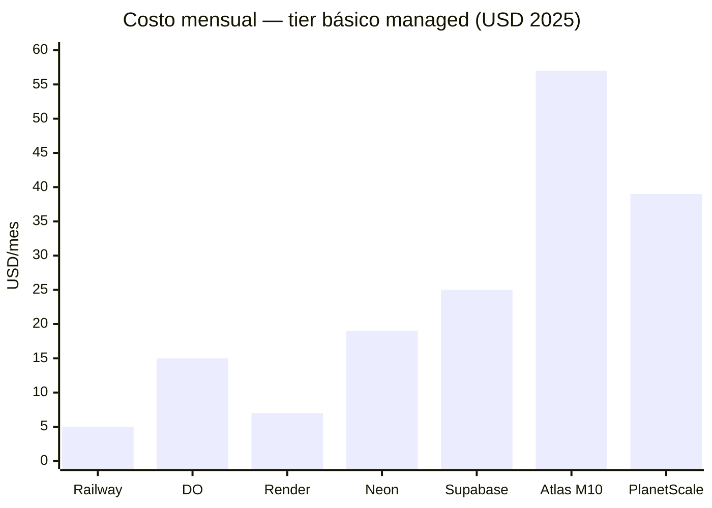

# Guía de bases de datos

> Comparativa completa, benchmarks, precios, recursos y veredictos honestos.
> Causa, acá no vas a encontrar el típico "depende del caso de uso" sin explicación. Cada base de datos tiene su sección con para qué sirve de verdad, quién la usa, y cuándo no usarla.

> **Estado editorial:** contenido en revisión continua. Los datos volátiles deben
> incluir fuente y fecha según la [metodología](./METHODOLOGY.md).

---

## Índice

| Sección | Descripción |
|---|---|
| [Tipos de bases de datos](#tipos-de-bases-de-datos) | OLTP, OLAP, NewSQL, vectoriales: qué son y para qué sirven |
| [SQL vs NoSQL](#sql-vs-nosql-la-pregunta-de-siempre) | Cuándo usar cada paradigma, sin respuestas vagas |
| [Rankings](#rankings) | Las mejores por categoría con justificación |
| [Para qué sirve cada una](#para-qué-sirve-cada-una) | Casos de uso reales, no teoría |
| [Bases de datos vectoriales](#bases-de-datos-vectoriales-era-de-la-ia) | El nuevo territorio del 2024-2025 |
| [Documentación individual](#documentación-individual) | Archivos detallados por base de datos |
| [Benchmarks](./BENCHMARKS.md) | Performance comparada con datos reales |
| [Precios](./PRICING.md) | Free tiers, más baratas, más caras |
| [Las Peores](./WORST.md) | Bases de datos cerradas o que evitar |
| [**Tierlist**](./TIERLIST.md) | Ranking visual con logos — S hasta R.I.P |
| [Recursos](./RESOURCES.md) | Tutoriales EN / ES / 中文 |
| [Metodología](./METHODOLOGY.md) | Fuentes, vigencia, benchmarks y criterios editoriales |
| [Contribuir](./CONTRIBUTING.md) | Cómo proponer correcciones y nuevas fichas |

---

## Tipos de bases de datos

Antes de elegir una base de datos hay que entender para qué tipo de trabajo está diseñada pe. Un error muy común es elegir la tecnología que suena más cool sin entender las categorías.

### OLTP — Procesamiento de transacciones en línea

La base de datos de tu app, pe. Guarda los datos de producción: usuarios, pedidos, mensajes, pagos. Recibe muchas escrituras y lecturas pequeñas al mismo tiempo, por muchos usuarios concurrentes. La consistencia es crítica porque no puedes perder un pago ni duplicar un registro.

Características clave:
- Lecturas y escrituras por ID específico (`SELECT * WHERE id = 123`)
- Muchas transacciones cortas y concurrentes
- Necesita ACID: si un pago falla a mitad, se revierte todo
- Tiempo de respuesta en milisegundos para el usuario final

**Ejemplos:** PostgreSQL, MySQL, SQLite, SQL Server, MongoDB

### OLAP — Procesamiento analítico en línea

La base de datos para analizar los datos de tu app, pe. No la usan los usuarios finales, la usa tu equipo de datos o tus dashboards internos. Las queries escanean millones o miles de millones de filas calculando agregaciones (SUM, COUNT, AVG, GROUP BY). La velocidad de respuesta puede ser de segundos, no de milisegundos.

Características clave:
- Queries que leen muchas filas pero pocas columnas
- Escrituras en batch, no transacciones individuales
- Almacenamiento columnar, mucho más eficiente para este patrón
- Compresión agresiva porque los datos son históricos

**Ejemplos:** ClickHouse, DuckDB, BigQuery, Redshift, Snowflake

### NewSQL — Distribuida con ACID

Intenta combinar la escala horizontal de los NoSQL con las garantías de los relacionales. Bases de datos que se distribuyen en múltiples nodos globalmente pero siguen ofreciendo SQL y transacciones ACID completas. Más lentas que PostgreSQL single-node para workloads no distribuidos, pe, pero imbatibles cuando el requerimiento es multi-región con consistencia fuerte.

**Ejemplos:** CockroachDB, YugabyteDB, Google Spanner

### Wide-Column — Escala masiva de escritura

Para escrituras de millones de eventos por segundo pe. El modelo no es el de una tabla relacional sino el de una clave principal que apunta a columnas dinámicas. Sin JOINs, sin relaciones, sin transacciones complejas. Puro volumen sostenido.

**Ejemplos:** Apache Cassandra, ScyllaDB, HBase, Google Bigtable

### Series de tiempo

Especializadas en datos con timestamp: métricas, sensores IoT, precios financieros históricos. Optimizadas para el patrón de insertar muchos datos ordenados por tiempo y consultarlos por rangos temporales. Una tabla de PostgreSQL puede hacerlo, pero a millones de filas por día se nota la diferencia.

**Ejemplos:** InfluxDB, TimescaleDB, VictoriaMetrics, Prometheus

### Grafos

Cuando las relaciones entre entidades importan tanto como los datos en sí pe. Redes sociales, detección de fraude, sistemas de recomendación. SQL puede hacer esto con JOINs recursivos pero se pone lento exponencialmente conforme crecen los nodos y las aristas.

**Ejemplos:** Neo4j, Amazon Neptune, ArangoDB

### Vectoriales

El tipo nuevo, explosivo desde 2023 por el boom de la IA. Guardan embeddings (vectores numéricos que representan texto, imágenes, audio) y permiten buscar por similitud semántica en lugar de por coincidencia exacta de palabras. El componente clave de los pipelines RAG (Retrieval-Augmented Generation).

**Ejemplos:** pgvector, Pinecone, Weaviate, Qdrant, Chroma

---

## SQL vs NoSQL: la pregunta de siempre

Causa, esta pregunta tiene mala fama porque la respuesta habitual es "depende" sin más explicación. Acá va una guía práctica.

### Usa SQL (relacional) cuando:

- Los datos tienen **estructura fija** y relaciones claras entre entidades
- Necesitas **integridad referencial** (que un pedido no pueda referenciar un usuario inexistente)
- Vas a hacer **queries no planeadas de antemano**: JOINs ad-hoc, filtros complejos, reportes variables
- La aplicación involucra **dinero o datos críticos** donde ACID es necesario
- El equipo ya sabe SQL, pe, no subestimes este punto

### Usa NoSQL cuando:

- Los datos tienen **estructura variable** por registro (cada producto tiene atributos distintos)
- Necesitas **escala horizontal masiva** donde un solo servidor no alcanza y el sharding de SQL es demasiado complejo para tu equipo
- El acceso siempre es por **clave primaria** sin JOINs (perfiles, sesiones, configuraciones)
- Trabajas con **documentos JSON** que cambiarían constantemente el schema si fueran tablas relacionales
- Priorizas **velocidad de prototipado** sobre integridad estricta en fases tempranas

### La verdad práctica

El 80% de los proyectos empiezan bien con PostgreSQL pe. Es ACID, es flexible (tiene `jsonb` para datos semi-estructurados), escala más de lo que la mayoría necesita, y es gratis. El momento de ir a NoSQL es cuando tienes un caso de uso específico que PostgreSQL resuelve mal, no cuando "crees que vas a escalar a millones de usuarios".

---

## Rankings

### Mejor por caso de uso

| Caso de uso | Ganadora | Por qué |
|---|---|---|
| App web general | **PostgreSQL** | ACID completo, extensible, gratis, feature-rica |
| Caché con licencia permisiva | **Valkey** | In-memory, BSD-3 y gobernanza comunitaria |
| Datos no estructurados / JSON | **MongoDB** | Schema flexible, escala horizontal, Atlas managed |
| App móvil / embedded | **SQLite** | Zero-config, archivo único, sin servidor |
| Escala masiva de escritura | **Cassandra** | Distribuida, sin SPOF, escritura sostenida |
| Relaciones complejas (grafos) | **Neo4j** | Traversal nativo, Cypher query language |
| Series de tiempo + SQL | **TimescaleDB** | PostgreSQL + hypertables, JOINs incluidos |
| Series de tiempo puro | **InfluxDB** | TSDB número uno, ecosistema TICK completo |
| Búsqueda rápida sin complejidad | **Meilisearch** | Typo-tolerante, MIT, sub-50ms, fácil de operar |
| Búsqueda a escala enterprise | **Elasticsearch** | ELK stack, logs masivos, analytics |
| Serverless AWS managed | **DynamoDB** | Cero operaciones, escala automática |
| Serverless PostgreSQL managed | **Neon** | Scale to zero, branches, free tier generoso |
| Realtime y móvil | **Firestore** | SDK realtime, offline, Firebase ecosystem |
| OLAP y analytics a escala | **ClickHouse** | Columnar C++, millones de filas en milisegundos |
| OLAP local y scripts de datos | **DuckDB** | Embebido, MIT, consulta Parquet y CSV directo |
| SQL distribuido con ACID global | **CockroachDB** | PostgreSQL-compatible, multi-región, 5 GB gratis |
| Vectores e IA (RAG) | **pgvector** | Extensión de PostgreSQL, sin infra nueva |

### Mejor gratis (self-hosted, sin restricciones)

```
1. PostgreSQL     → mejor general, licencia PostgreSQL (más permisiva que MIT)
2. SQLite         → mejor embedded, dominio público
3. Valkey         → mejor caché, BSD-3
4. MariaDB        → mejor MySQL-compatible, GPL v2
5. ClickHouse     → mejor OLAP, Apache 2.0
6. DuckDB         → mejor analítico embedded, MIT
7. Cassandra      → mejor wide-column, Apache 2.0
8. Meilisearch    → mejor search engine, MIT
9. Neo4j          → mejor grafos, GPL v3 (Community)
10. CockroachDB   → mejor NewSQL, BSL → Apache 2.0 (3 años)
```

### Mejor free tier managed (nunca expira)

| Servicio | Base de datos | Storage | Lo destacable |
|---|---|---|---|
| **Neon** | PostgreSQL | 512 MB | 100 proyectos, branches ilimitados, nunca expira |
| **CockroachDB** | PostgreSQL-compat | 5 GB | Multi-región gratis, el más generoso en storage |
| **Turso** | SQLite (libSQL) | 5 GB | Edge SQL, 500M reads/mes, 100 DBs |
| **MongoDB Atlas** | MongoDB | 512 MB | Nunca expira, sólido para proyectos pequeños |
| **Supabase** | PostgreSQL | 500 MB | Auth + Storage + Realtime incluidos |
| **Upstash** | Valkey/Redis | 256 MB | Serverless, pay-per-use, nunca expira |
| **Firestore** | NoSQL doc | 1 GB | 50K reads/día, realtime incluido |

---

## Para qué sirve cada una

Causa, acá está el resumen práctico de cada base de datos. Sin rodeos, sin "depende", casos concretos.

### PostgreSQL

Para qué es: la base de datos principal de tu app pe. Guarda usuarios, pedidos, pagos, contenido, lo que sea que necesite estructura y consistencia. El tipo jsonb le permite manejar datos semi-estructurados sin ir a MongoDB. PostGIS le agrega datos geoespaciales. TimescaleDB le agrega series de tiempo. pgvector le agrega búsqueda semántica para IA. Es la base de datos más versátil que existe.

Quién la usa: Instagram (migró desde MongoDB), Reddit, Spotify, Twitch, Figma, Notion, y toda la plataforma Supabase corre encima de ella.

No la uses para: caché de alta velocidad (Valkey), analytics de miles de millones de filas (ClickHouse), escrituras de millones de eventos por segundo sostenidos (Cassandra).

---

### MySQL y MariaDB

Para qué es: lo mismo que PostgreSQL pero con historia diferente pe. MySQL está en la mayoría de hostings compartidos y es el default de WordPress, Drupal y Joomla. MariaDB es el fork que escapó de Oracle, es 11-16% más rápido y tiene licencia más limpia. Si empiezas un proyecto nuevo, PostgreSQL es la mejor opción pe. Si ya tienes MySQL en producción y funciona bien, no hay razón urgente de migrar.

No la uses para: proyectos nuevos donde puedas elegir libremente. Causa, elige PostgreSQL directamente.

---

### SQLite

Para qué es: la base de datos más deployada del mundo. Está en todos los iPhones, en todos los Android, en los routers, en los aviones. Es un archivo .db en disco, sin servidor, sin configuración. Para apps móviles es el default natural. Para CLIs con datos persistentes y para testing es perfecta pe.

No la uses para: apps web con múltiples usuarios concurrentes escribiendo. SQLite tiene locking de escritura a nivel de archivo completo, así que las escrituras simultáneas se bloquean entre sí.

---

### MongoDB

Para qué es: documentos JSON con schema flexible. El catálogo de productos donde electrónica tiene voltaje y ropa tiene talla pero comparten la misma colección. El CMS donde cada tipo de artículo tiene campos distintos. El sistema de perfiles con atributos variables. El sharding nativo la hace escalable horizontalmente sin tanto drama como PostgreSQL pe.

No la uses para: datos con relaciones complejas (usa PostgreSQL), o cuando el argumento principal es "no sé qué schema voy a tener". Esa es exactamente la situación donde forzarte a definir un schema te ayuda pe.

---

### Redis y Valkey

Para qué es: caché, sesiones de usuario, rate limiting, colas de mensajes, contadores en tiempo real. Todo en memoria, sub-milisegundo. Si tu query de PostgreSQL tarda 200ms, guardas el resultado en Valkey con TTL de 5 minutos y las siguientes requests tardan menos de 1ms. Es el complemento de cualquier base de datos principal, no un reemplazo.

No la uses para: datos primarios de tu app. Si Valkey se reinicia sin persistencia configurada, se pierden los datos.

Licencias verificadas el 2026-07-07: Valkey mantiene BSD-3 y gobernanza de la Linux Foundation. Redis cambió a RSALv2/SSPLv1 en 2024, pero Redis 8 añadió AGPLv3 como opción OSI-approved en 2025. Por tanto, ambos son open source hoy; la diferencia principal es licencia permisiva y gobernanza comunitaria en Valkey frente a copyleft y control de proveedor en Redis 8. Consulta la [matriz oficial de licencias de Redis](https://redis.io/legal/licenses/).

---

### Cassandra

Para qué es: escrituras masivas y distribuidas pe. Cuando necesitas insertar millones de eventos por segundo de forma continua (IoT, logs de usuarios, historial de clicks, datos de sensores) y consultarlos después por rango. Sin punto único de falla. Netflix la usa para el historial de visualización de millones de usuarios.

No la uses para: queries ad-hoc complejas pe. No tiene JOINs, y los modelos de datos deben diseñarse según los patrones de acceso conocidos. Modelar Cassandra como si fuera PostgreSQL resulta en consultas imposibles.

---

### ScyllaDB

Para qué es: lo mismo que Cassandra pero escrito en C++ sin JVM ni garbage collector. Resulta 2x-10x más rápido con menos nodos. Drop-in replacement de Cassandra.

Nota diciembre 2024: cambió a licencia source-available. Para proyectos nuevos open-source, usa Cassandra. Para empresas con presupuesto enterprise, ScyllaDB sigue siendo la opción técnicamente superior.

---

### Neo4j

Para qué es: cuando la relación entre entidades importa tanto como los datos en sí pe. Red de amigos a qué profundidad, detección de fraude por patrones de conexión entre cuentas, motores de recomendación basados en comportamiento de usuarios similares. En un relacional, esto requiere JOINs recursivos que se vuelven lentos exponencialmente. En Neo4j es una sola query con Cypher.

No la uses para: datos sin relaciones complejas. Si el modelo es básicamente tablas sin muchos vínculos entre entidades, PostgreSQL es más simple pe.

---

### Elasticsearch

Para qué es: búsqueda full-text a escala enterprise y análisis de logs pe. El stack ELK (Elasticsearch, Logstash, Kibana) es el estándar industrial para centralizar logs de múltiples servicios, visualizarlos y alertar sobre anomalías. Wikipedia lo usa para buscar artículos. GitHub lo usa para buscar código.

No la uses para: base de datos principal. Elasticsearch no garantiza integridad de datos de la misma forma que un relacional. Úsalo como índice de búsqueda sobre tu fuente de verdad en otra base de datos.

---

### Meilisearch

Para qué es: la barra de búsqueda de tu app pe. Cuando LIKE en PostgreSQL ya no alcanza porque es lento o no tolera errores tipográficos. Meilisearch responde en menos de 50ms y encuentra "lapiz" cuando el usuario escribió "lápiz". Mucho más simple de operar que Elasticsearch para casos de uso medianos.

No la uses para: logs a escala de petabytes (Elasticsearch), analytics sobre los datos buscados (no es una base analítica).

---

### InfluxDB

Para qué es: el número uno en series de tiempo puro pe. Métricas de servidores, datos de IoT, datos financieros con timestamp. El stack TICK (Telegraf, InfluxDB, Chronograf, Kapacitor) es el equivalente de ELK pero para métricas. Grafana con InfluxDB es el combo más común en entornos DevOps.

Nota: InfluxDB v2 y superior es propietario. La versión v1.x es MIT y sigue siendo muy usada. TimescaleDB es la alternativa con SQL completo si ya usas PostgreSQL.

---

### TimescaleDB

Para qué es: series de tiempo con SQL completo pe. Si ya tienes PostgreSQL y necesitas agregar series de tiempo, es una extensión que se instala en minutos. La ventaja sobre InfluxDB es que puedes hacer JOINs entre tus métricas y tus tablas de negocio en la misma query. Cosa imposible en InfluxDB.

---

### ClickHouse

Para qué es: analytics a gran escala pe. Millones o miles de millones de filas que necesitas consultar con agregaciones rápidas. Dashboards de producto, análisis de logs, datos de clickstream, telemetría. Cloudflare procesa seis millones de eventos por segundo con ClickHouse. No es para OLTP, es para el trabajo analítico sobre datos históricos.

---

### DuckDB

Para qué es: análisis de datos local, scripts de data science, ETL sin servidor pe. El SQLite de analytics. Consulta archivos Parquet, CSV y JSON directamente con SQL sin importarlos primero. En Python basta con importar la librería y ya puedes hacer queries sobre cualquier archivo. Muy usado en notebooks de data science y en la comunidad dbt.

---

### DynamoDB

Para qué es: la base de datos serverless de AWS pe. Si ya estás en AWS y necesitas cero operaciones, escala automática y latencia de un dígito de milisegundo, DynamoDB es la opción. El modelo de datos es distinto al relacional (single-table design) pero una vez que lo entiendes, es muy poderoso para acceso por clave primaria.

No la uses para: queries complejas ad-hoc, JOINs, aggregations, o si el presupuesto es ajustado con alto volumen de escrituras.

---

### Firestore

Para qué es: apps móviles y web con sincronización en tiempo real pe. Cada cambio en la base de datos llega automáticamente a todos los clientes conectados vía el SDK de Firebase. Soporte offline incluido. Perfecto para apps de chat, colaborativas, o cualquier cosa donde los datos deben verse actualizados en vivo.

No la uses para: queries complejas tipo SQL, contadores de alta frecuencia (límite de 1 escritura/segundo por documento), o cuando no quieras lock-in con Google.

---

### CockroachDB

Para qué es: PostgreSQL distribuido en múltiples regiones con ACID completo pe. Cuando tu app tiene usuarios en Europa y en Asia y necesitas que los datos estén cerca de ellos sin sacrificar consistencia. El free tier de 5 GB que nunca expira es el más generoso de bases de datos distribuidas.

---

### SQL Server

Para qué es: ecosistema Microsoft pe. Apps .NET, Azure, herramientas de BI de Microsoft (SSRS, SSAS, SSIS), y empresas que ya viven en el mundo Windows Server. Técnicamente sólido pero caro y con lock-in fuerte hacia el ecosistema de Microsoft.

---

## Bases de datos vectoriales (era de la IA)

Causa, desde 2023 este es el nuevo territorio. Los modelos de lenguaje convierten texto en vectores numéricos llamados embeddings. Dos textos con significado similar tienen vectores cercanos en el espacio matemático. Las bases de datos vectoriales permiten buscar "dame los documentos más similares a esta query" en lugar de "dame los documentos que contienen esta palabra exacta".

El caso de uso principal es RAG (Retrieval-Augmented Generation): le das al modelo de IA acceso a tus documentos propios buscando los más relevantes antes de generar la respuesta. Es lo que permite que un chatbot corporativo responda sobre documentos internos de la empresa sin haberlos visto en el entrenamiento.

### pgvector: la opción más práctica

Si ya usas PostgreSQL, pgvector es una extensión que agrega el tipo de dato vector y operadores de similitud. Sin nueva infraestructura, sin nueva base de datos que aprender. El operador `<=>` calcula distancia coseno entre vectores.

```sql
CREATE EXTENSION vector;

CREATE TABLE documentos (
  id SERIAL PRIMARY KEY,
  contenido TEXT,
  embedding vector(1536)
);

-- Los 5 documentos más similares a una query
SELECT contenido
FROM documentos
ORDER BY embedding <=> '[0.1, 0.2, ...]'::vector
LIMIT 5;
```

### Pinecone

El managed vector database más popular pe. Diseñado exclusivamente para embeddings. Sin servidor que manejar, API simple, free tier de 2 GB. Mejor opción si quieres zero-ops para un pipeline RAG en producción.

### Weaviate

Open-source BSD-3, puede hacer búsqueda vectorial y full-text al mismo tiempo (hybrid search). Incluye módulos de vectorización automática conectados a OpenAI, Cohere y HuggingFace.

### Qdrant

Open-source Apache 2.0, escrito en Rust, muy rápido, con filtros sobre metadatos junto con la búsqueda vectorial pe. Free tier en Qdrant Cloud.

### Chroma

Open-source Apache 2.0, la base de datos vectorial más simple de usar en Python. Una línea de instalación, dos líneas de código para indexar y buscar. Ideal para prototipos y proyectos personales.

### Cuál elegir

```
Ya tienes PostgreSQL     → pgvector. Sin nueva infraestructura.
Producción, zero-ops     → Pinecone. Managed, escalable.
Open-source, rápido      → Qdrant. Apache 2.0, escrito en Rust.
Prototipo Python         → Chroma. Lo más rápido de arrancar.
Hybrid search            → Weaviate. Vector y texto al mismo tiempo.
```

---

## Documentación individual

### Relacionales (SQL)

<table>
<tr>
<td align="center" width="130">
<br/>
<b><a href="./databases/postgresql.md">PostgreSQL</a></b><br/>
<sub>★★★★★</sub>
</td>
<td align="center" width="130">
<br/>
<b><a href="./databases/mysql.md">MySQL</a></b><br/>
<sub>★★★</sub>
</td>
<td align="center" width="130">
<br/>
<b><a href="./databases/mariadb.md">MariaDB</a></b><br/>
<sub>★★★★</sub>
</td>
<td align="center" width="130">
<br/>
<b><a href="./databases/sqlite.md">SQLite</a></b><br/>
<sub>★★★★★</sub>
</td>
<td align="center" width="130">
<br/>
<b><a href="./databases/sqlserver.md">SQL Server</a></b><br/>
<sub>★★★</sub>
</td>
</tr>
</table>

### NoSQL — Documentos

<table>
<tr>
<td align="center" width="130">
<br/>
<b><a href="./databases/mongodb.md">MongoDB</a></b><br/>
<sub>★★★★</sub>
</td>
<td align="center" width="130">
<br/>
<b><a href="./databases/firestore.md">Firestore</a></b><br/>
<sub>★★★★</sub>
</td>
</tr>
</table>

### NoSQL — Clave-Valor

<table>
<tr>
<td align="center" width="130">
<br/>
<b><a href="./databases/redis.md">Redis</a></b><br/>
<sub>★★★ (licencia)</sub>
</td>
<td align="center" width="130">
<br/>
<b><a href="./databases/valkey.md">Valkey</a></b><br/>
<sub>★★★★★</sub>
</td>
<td align="center" width="130">
<br/>
<b><a href="./databases/dynamodb.md">DynamoDB</a></b><br/>
<sub>★★★★</sub>
</td>
</tr>
</table>

### NoSQL — Wide-Column

<table>
<tr>
<td align="center" width="130">
<br/>
<b><a href="./databases/cassandra.md">Cassandra</a></b><br/>
<sub>★★★★★</sub>
</td>
<td align="center" width="130">
<br/>
<b><a href="./databases/scylladb.md">ScyllaDB</a></b><br/>
<sub>★★★ (licencia)</sub>
</td>
</tr>
</table>

### NewSQL — Distribuida con ACID

<table>
<tr>
<td align="center" width="130">
<br/>
<b><a href="./databases/cockroachdb.md">CockroachDB</a></b><br/>
<sub>★★★★★</sub>
</td>
</tr>
</table>

### Grafos

<table>
<tr>
<td align="center" width="130">
<br/>
<b><a href="./databases/neo4j.md">Neo4j</a></b><br/>
<sub>★★★★</sub>
</td>
</tr>
</table>

### Búsqueda

<table>
<tr>
<td align="center" width="130">
<br/>
<b><a href="./databases/elasticsearch.md">Elasticsearch</a></b><br/>
<sub>★★★★</sub>
</td>
<td align="center" width="130">
<br/>
<b><a href="./databases/meilisearch.md">Meilisearch</a></b><br/>
<sub>★★★★★</sub>
</td>
</tr>
</table>

### Series de tiempo

<table>
<tr>
<td align="center" width="130">
<br/>
<b><a href="./databases/influxdb.md">InfluxDB</a></b><br/>
<sub>★★★★</sub>
</td>
<td align="center" width="130">
<br/>
<b><a href="./databases/timescaledb.md">TimescaleDB</a></b><br/>
<sub>★★★★★</sub>
</td>
</tr>
</table>

### OLAP — Analytics

<table>
<tr>
<td align="center" width="130">
<br/>
<b><a href="./databases/clickhouse.md">ClickHouse</a></b><br/>
<sub>★★★★★</sub>
</td>
<td align="center" width="130">
<br/>
<b><a href="./databases/duckdb.md">DuckDB</a></b><br/>
<sub>★★★★★</sub>
</td>
</tr>
</table>

---

## Benchmark rápido

Una gráfica única de “operaciones por segundo” entre motores con workloads,
hardware y garantías distintas produce una comparación falsa. Consulta cómo
diseñar y leer pruebas reproducibles en [BENCHMARKS.md](./BENCHMARKS.md).

---

## Precios rápido



> Ver comparativa detallada con free tiers → [PRICING.md](./PRICING.md)

---

## Las peores

> Bases de datos cerradas, con bait-and-switch de licencia, o que evitar → [WORST.md](./WORST.md)
