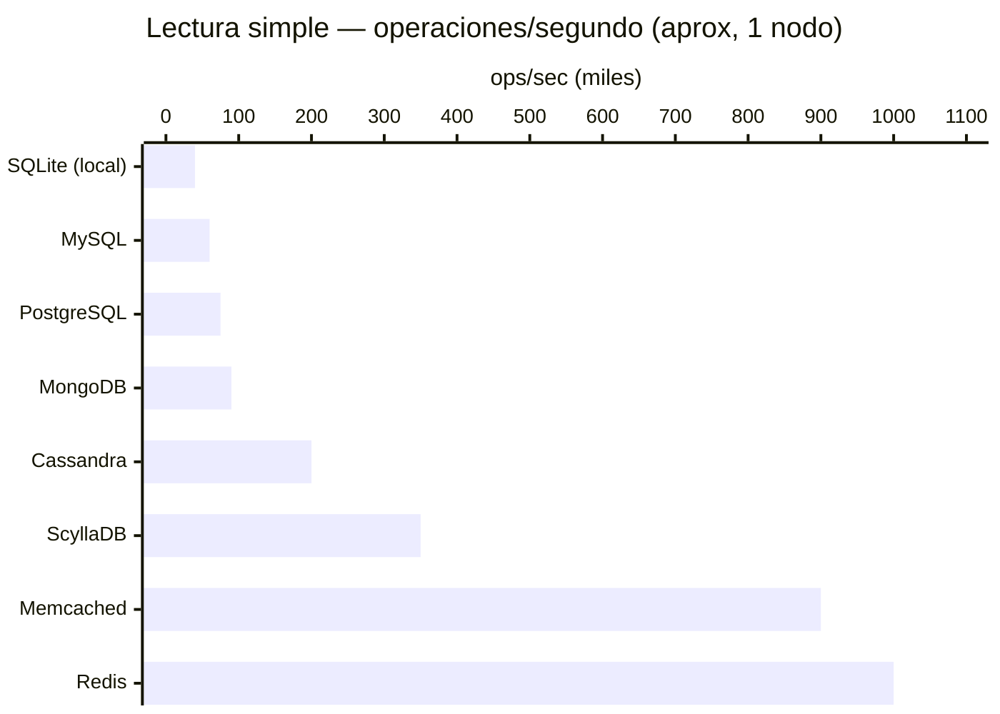
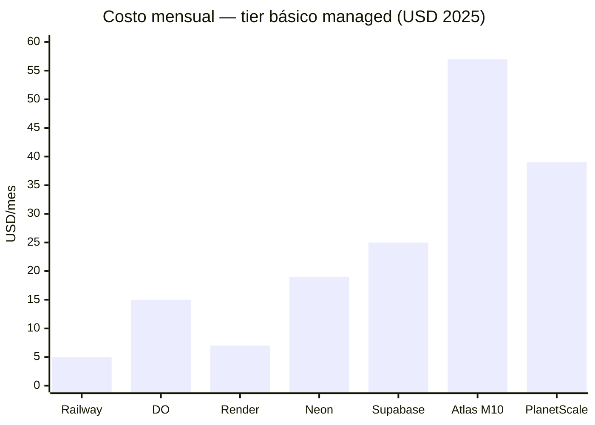

# Database Guide

> Comparativa completa, benchmarks, precios y recursos de bases de datos.

> Guía verificada con benchmarks reales, precios actualizados 2025, tutoriales en **English · Español · 中文**, y veredictos honestos sobre qué usar y qué evitar.


## índice

| Sección | Descripción |
|---|---|
| [Rankings](#-rankings) | Las mejores por categoría |
| [Benchmarks](./BENCHMARKS.md) | Performance comparada con datos reales |
| [Precios](./PRICING.md) | Free tiers, más baratas, más caras |
| [Las Peores](./WORST.md) | Bases de datos a evitar y por qué |
| [ Recursos](./RESOURCES.md) | Todos los tutoriales EN / ES / ZH |
| [ Bases de datos individuales](#-bases-de-datos) | Docs detallados por DB |


## Rankings

### Mejor overall por caso de uso

| Caso de uso | Ganadora | Por qué |
|---|---|---|
| App web general | **PostgreSQL** | ACID, extensible, gratis, feature-rica |
| Caché / velocidad extrema | **Redis** | In-memory, 1M+ ops/sec |
| Datos no estructurados / JSON | **MongoDB** | Flexible schema, escala horizontal fácil |
| App mobile / embedded | **SQLite** | Zero-config, archivo único, sin servidor |
| Escala masiva / petabytes | **Cassandra / ScyllaDB** | Distribuida, sin SPOF, escritura brutal |
| Relaciones complejas (grafos) | **Neo4j** | Traversal nativo, Cypher query language |
| Series de tiempo / métricas | **InfluxDB / TimescaleDB** | Compresión, downsampling, queries temporales |
| Búsqueda full-text | **Elasticsearch / Meilisearch** | Indexado invertido, relevancia, faceting |
| Serverless / edge | **Turso (SQLite)** | SQLite en el edge, latencia mínima |
| Vector / AI embeddings | **Pgvector / Pinecone** | Similarity search, RAG pipelines |

### Mejor gratis

```
1. PostgreSQL       → mejor free en general (self-hosted)
2. SQLite           → mejor para apps pequeñas / móvil
3. Redis OSS        → mejor caché gratis (self-hosted)
4. MariaDB          → alternativa MySQL 100% gratis
5. Supabase Free    → mejor managed gratis (PostgreSQL)
```

### Mejor relación costo-beneficio (managed)

```
1. Neon (PostgreSQL)    → desde $0, serverless, scale to zero
2. Railway              → desde $5/mes, cualquier DB
3. Supabase             → $25/mes Pro, todo incluido
4. DigitalOcean         → $15/mes managed PostgreSQL
5. Upstash              → Redis serverless pay-per-use
```


## Bases de Datos

### Relacionales (SQL)

<table>
<tr>
<td align="center" width="130">
<br/>
<b><a href="./databases/postgresql.md">PostgreSQL</a></b><br/>
<sub>★★★★★</sub>
</td>
<td align="center" width="130">
<br/>
<b><a href="./databases/mysql.md">MySQL</a></b><br/>
<sub>★★★★</sub>
</td>
<td align="center" width="130">
<br/>
<b><a href="./databases/mariadb.md">MariaDB</a></b><br/>
<sub>★★★★</sub>
</td>
<td align="center" width="130">
<br/>
<b><a href="./databases/sqlite.md">SQLite</a></b><br/>
<sub>★★★★★</sub>
</td>
<td align="center" width="130">
<br/>
<b><a href="./databases/sqlserver.md">SQL Server</a></b><br/>
<sub>★★★</sub>
</td>
</tr>
</table>

### NoSQL — Documentos

<table>
<tr>
<td align="center" width="130">
<br/>
<b><a href="./databases/mongodb.md">MongoDB</a></b><br/>
<sub>★★★★</sub>
</td>
<td align="center" width="130">
<br/>
<b>CouchDB</b><br/>
<sub>★★★</sub>
</td>
<td align="center" width="130">
<br/>
<b>Firestore</b><br/>
<sub>★★★★</sub>
</td>
</tr>
</table>

### NoSQL — Clave-Valor

<table>
<tr>
<td align="center" width="130">
<br/>
<b><a href="./databases/redis.md">Redis</a></b><br/>
<sub>★★★★★</sub>
</td>
<td align="center" width="130">
<br/>
<b>DynamoDB</b><br/>
<sub>★★★★</sub>
</td>
</tr>
</table>

### NoSQL — Columnar / Wide-Column

<table>
<tr>
<td align="center" width="130">
<br/>
<b><a href="./databases/cassandra.md">Cassandra</a></b><br/>
<sub>★★★★</sub>
</td>
<td align="center" width="130">
<br/>
<b><a href="./databases/scylladb.md">ScyllaDB</a></b><br/>
<sub>★★★★★</sub>
</td>
</tr>
</table>

### Grafos

<table>
<tr>
<td align="center" width="130">
<br/>
<b><a href="./databases/neo4j.md">Neo4j</a></b><br/>
<sub>★★★★★</sub>
</td>
</tr>
</table>

### Búsqueda

<table>
<tr>
<td align="center" width="130">
<br/>
<b><a href="./databases/elasticsearch.md">Elasticsearch</a></b><br/>
<sub>★★★★</sub>
</td>
<td align="center" width="130">
<br/>
<b>Meilisearch</b><br/>
<sub>★★★★★</sub>
</td>
</tr>
</table>

### Series de Tiempo

<table>
<tr>
<td align="center" width="130">
<br/>
<b><a href="./databases/influxdb.md">InfluxDB</a></b><br/>
<sub>★★★★</sub>
</td>
<td align="center" width="130">
<br/>
<b>TimescaleDB</b><br/>
<sub>★★★★★</sub>
</td>
</tr>
</table>


## Benchmark Rápido



>  Ver análisis completo → [BENCHMARKS.md](./BENCHMARKS.md)


## Precios Rápido



>  Ver comparativa detallada → [PRICING.md](./PRICING.md)


## Las Peores

>  Ver lista completa con razones → [WORST.md](./WORST.md)


