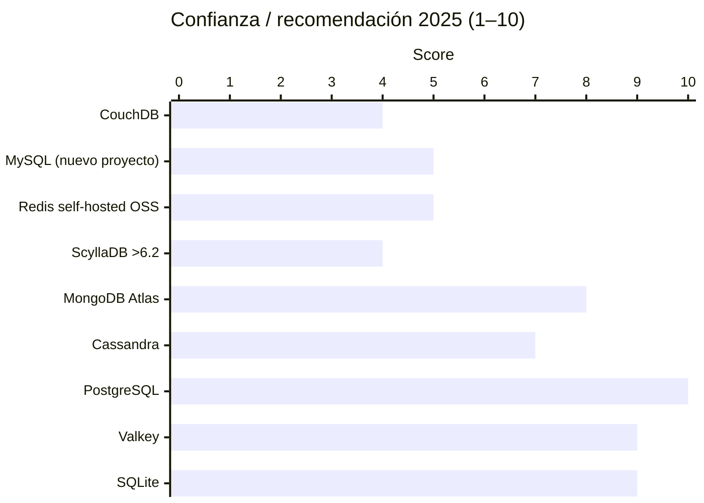

# Las Peores — Bases de Datos a Evitar

> Datos verificados. Includes shutdowns reales, license bait-and-switch, y problemas documentados.

---

## Bases de datos MUERTAS (2024–2025)

### FaunaDB — CERRADA mayo 30, 2025


```
Estado:     [CERRADA]
Fecha:      30 mayo 2025
Afectados:  3,000+ equipos de desarrollo, 195+ bases de datos
```

FaunaDB era una base de datos multi-modelo distribuida globalmente con transacciones ACID. Prometedora en concepto, pero capital-intensiva. La empresa no pudo conseguir ronda de financiamiento adicional. **Cerró sin previo aviso adecuado.** Una versión open-source prometida del core engine aún no ha materializado a la fecha del cierre.

> **Si usabas FaunaDB: migra ya. Los datos podrían no estar disponibles.**

---

### Amazon QLDB — CERRADA 2024

```
Estado:     [CERRADA]
Año:        2024
```

QLDB (Quantum Ledger Database) era la propuesta de AWS para bases de datos con verificación criptográfica de historial inmutable. Cerrada después de no generar revenue significativo. AWS dio poco aviso a los clientes afectados.

---

### Rockset — CERRADA septiembre 2024

```
Estado:     [CERRADA] (servicio DBaaS)
Fecha:      Septiembre 2024
Motivo:     Adquirida por OpenAI
```

Base de datos para analytics en tiempo real. OpenAI la adquirió para uso interno y cerró el servicio público. Los clientes de analytics en tiempo real quedaron sin alternativa inmediata.

---

### Greenplum — Abandonada / Propietaria 2024

```
Estado:     [AVISO] Repositorio open-source eliminado silenciosamente en 2024
Años activo: 9 años de open-source
```

> Andy Pavlo (CMU): *"La gente no notó porque nadie ejecuta Greenplum voluntariamente de todas formas."*

Después de 9 años, el repositorio open-source fue eliminado sin anuncio mayor. Migró a modelo propietario. No era popular por razones: rendimiento inconsistente, operación compleja.

---

## [AVISO] Bait-and-Switch de Licencias

### Redis → Valkey (fork open-source)


```
Cambio:   BSD-3 (open source) → SSPL + propietario
Fecha:    2024
Respuesta: Fork Valkey (Linux Foundation, respaldado por Amazon, Google, Oracle)
```

**Historia**: Redis Ltd. cambió la licencia de Redis de BSD-3 a SSPL/propietario en 2024. La comunidad respondió con el fork **Valkey** bajo Linux Foundation.

**Resultados de Valkey en 2025**:
- 8% más rápido en throughput general que Redis 8.0
- 37% más alto en SET throughput
- 30% mejor p99 latencia en SET
- 60%+ mejor p99 latencia en GET

```
Recomendación: Usa Valkey en proyectos nuevos.
               Redis sigue siendo bueno si usas el servicio managed (Redis Cloud).
               Self-hosted open-source: Valkey es la opción.
```

---

### ScyllaDB — Eliminó licencia AGPL (diciembre 2024)


```
Cambio:        AGPL (open source) → Source Available (enterprise only)
Fecha:         Diciembre 2024
Último OSS:    Versión 6.2 (AGPL, congelada)
```

ScyllaDB, la reimplementación en C++ de Cassandra (mucho más rápida), eliminó su licencia open-source. Ahora requiere licencia enterprise para nuevos releases.

**Implicaciones**:
- No puedes actualizar más allá de 6.2 sin pagar
- No puedes ofrecer ScyllaDB como servicio sin acuerdo comercial
- El argumento técnico (2x–5x vs Cassandra) sigue siendo real, pero el precio de acceso cambió

```
Recomendación: Nuevos proyectos que necesiten un Cassandra-compatible open-source:
               → Apache Cassandra 5.x
               Proyectos existentes en ScyllaDB con budget enterprise:
               → ScyllaDB Enterprise (si el throughput lo justifica)
```

---

### Elasticsearch — Ida y vuelta de licencias


```
2021: Apache 2.0 → SSPL (bait-and-switch)
       → Amazon forkea y crea OpenSearch
2024: SSPL → AGPL (reversión)
```

Elastic fue el primer caso famoso de license bait-and-switch. Cambió a SSPL en 2021 directamente como ataque a AWS. Amazon respondió forkeando OpenSearch. En 2024, Elastic revirtió a AGPL — pero el daño de confianza ya estaba hecho y OpenSearch tiene comunidad propia.

---

##  En Declive — Usar con Precaución

### MySQL


```
DB-Engines rank: #2 (pero cayendo)
Admiration rate (SO 2025): 20.5% vs PostgreSQL 46.5%
Contributors activos: ~75 (desde 198 en 2006)
Commits anuales: Caída ~4x en 14 años
```

**Problemas documentados**:
- Oracle priorizó MySQL Heatwave (comercial) sobre Community Edition
- MySQL 9.0.0 salió con bug crítico de crash al tener >8,000 tablas (Bug #36808732)
- Los developers de MySQL Community Edition fueron layoff'd por Oracle
- 11–16% más lento que MariaDB en benchmarks comparativos (2024)
- Solo 20.5% de "admiration rate" en Stack Overflow Developer Survey 2025

**Fuentes**: [InfoQ dic 2025](https://www.infoq.com/news/2025/12/mysql-declining-development/), [DoltHub 2024](https://www.dolthub.com/blog/2024-10-14-is-mysql-dying/)

```
Recomendación: Proyectos existentes con MySQL → MariaDB es drop-in replacement
               Proyectos nuevos → PostgreSQL o MariaDB directamente
```

---

### Apache CouchDB


```
Problemas:
- Rendimiento inferior a MongoDB en la mayoría de workloads
- Requiere otra DB para reporting y analytics
- Actividad de comunidad limitada
- CVE-2022-24706: vulnerabilidad crítica CISA Known Exploited
```

La promesa de CouchDB (sync offline, multi-master) nunca se tradujo en adopción masiva. En la práctica, lo que intentas hacer con CouchDB lo haces mejor con MongoDB + un servicio de sync, o con PouchDB + Supabase.

---

### Render PostgreSQL Free

```
[AVISO] No es un free tier real
Elimina la base de datos a los 30 días
14 días de gracia para upgrade (después: datos borrados permanentemente)
```

Mencionado por la cantidad de proyectos que lo usan sin saber este detalle.

---

##  Ranking por "confianza en 2025"



---

> [← Precios](./PRICING.md) &nbsp;|&nbsp; [ Recursos →](./RESOURCES.md)
