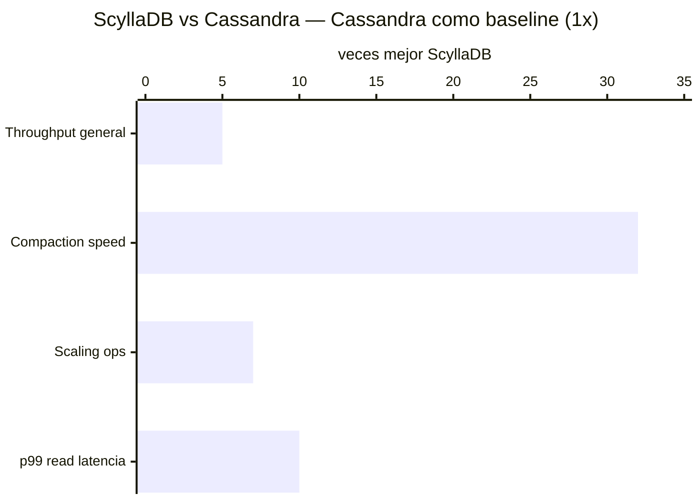

<div align="center">


# Apache Cassandra


**Escala hasta millones de escrituras por segundo. Sin punto único de falla. Usado por Netflix, Apple, Discord. La alternativa open-source real a ScyllaDB post-2024.**

</div>

---

##  Quick stats

| Atributo | Valor |
|---|---|
| Tipo | Wide-Column (NoSQL) |
| ACID |  Eventual consistency (LWT parcial para ACID) |
| Licencia | Apache 2.0  (OSS real) |
| Lanzamiento | 2008 (Facebook) → 2010 (Apache) |
| DB-Engines rank | #11 |
| Casos de uso | Netflix, Apple, Discord, Instagram |
| Sin SPOF |  Peer-to-peer, todos los nodos iguales |
| Managed | DataStax Astra DB, AWS Keyspaces |

---

##  Cuándo usarlo

- Escrituras masivas y continuas (IoT, logs, time series)
- Replicación multi-datacenter nativa
- Alta disponibilidad absoluta (99.999% uptime posible)
- Datos de séries de tiempo sin TimescaleDB
- Sistemas que no pueden tolerar downtime en nodo único
- >100K escrituras/seg sostenidas
- Netflix-scale de datos de usuarios, eventos, historial

##  Cuándo NO usarlo

- Queries complejos con JOINs → PostgreSQL
- Datos fuertemente relacionados → cualquier SQL
- Full-text search → Elasticsearch
- Cache → Redis/Valkey
- Equipos pequeños sin experiencia NoSQL (curva de aprendizaje alta)
- Proyectos donde ACID completo es crítico

---

##  Performance

```
Lectura (YCSB, 4 nodos):       ~77,500 ops/seg
Lectura (YCSB, 20 nodos):      ~200,000 ops/seg  
Escritura (YCSB, 4 nodos):     ~7,200 ops/seg (consistency=QUORUM)
Latencia p50:                  ~2ms
Latencia p99:                  ~10ms
Escalabilidad:                 Lineal con nodos añadidos
```

---

## 🆚 Cassandra vs ScyllaDB (2025)



| Métrica | Cassandra | ScyllaDB |
|---|---|---|
| Arquitectura | Java + JVM (GC pauses) | C++ (sin JVM, sin GC) |
| Licencia 2025 | **Apache 2.0**  | Source-available [AVISO] |
| Throughput | baseline | 2x–5x mayor |
| p99 insert | 5–70ms | 5ms estable |
| p99 read | 40–125ms | 15ms |
| Compaction | baseline | **32x más rápido** |
| Costo operativo | mayor (más nodos) | menor (10x menos nodos) |

> [AVISO] **ScyllaDB eliminó su licencia AGPL en diciembre 2024.** Para nuevos proyectos open-source: **Apache Cassandra 5.x**.

---

## ️ Arquitectura

```
┌─────────────────────────────────────────────┐
│            Cassandra Ring                   │
│                                             │
│   Node A ──── Node B ──── Node C           │
│     │                         │             │
│   Node F                   Node D           │
│     │                         │             │
│   Node E ────────────────────                │
│                                             │
│  Cada nodo: igual, sin líder                │
│  Replicación: configurable (RF=3 typical)   │
│  Consistencia: configurable por query       │
└─────────────────────────────────────────────┘
```

---

## Precios managed

| Servicio | Free | Paid desde |
|---|---|---|
| **DataStax Astra DB** | 25 GB, serverless | $0.10/million RU |
| **AWS Keyspaces** |  | ~$1.46/million write units |
| **Self-hosted** |  Gratis (Apache 2.0) | Solo infraestructura |

---

##  Tutoriales

### English
[](https://www.youtube.com/watch?v=J-cSy5MeMOA)
[](https://www.youtube.com/watch?v=s1xc1HVsRk0)

### 中文
[](https://www.bilibili.com/video/BV1ZA411674Z)

### Español
 [Buscar: Cassandra en español](https://www.youtube.com/results?search_query=apache+cassandra+tutorial+español)

---

##  Links

-  [Documentación oficial](https://cassandra.apache.org/doc/latest/)
-  [DataStax Academy — cursos gratis](https://www.datastax.com/learn)
-  [DataStax Astra DB (managed gratis)](https://astra.datastax.com/)
-  [Cassandra vs ScyllaDB benchmarks](https://www.scylladb.com/product/benchmarks/)

---

> [← README](../README.md)
