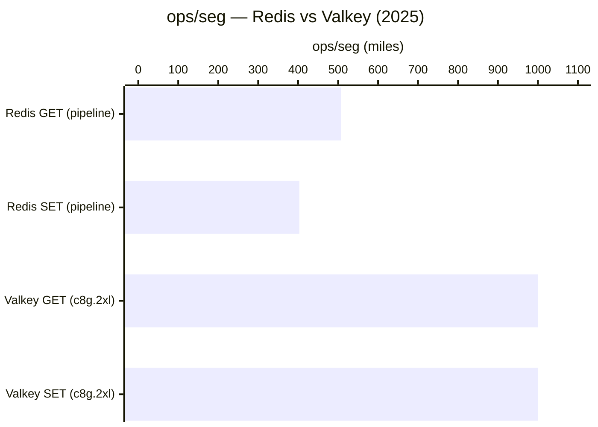

<div align="center">


# Redis / Valkey


**El rey de in-memory. Redis cambió de licencia en 2024 → la comunidad forkeó Valkey (Linux Foundation). Para self-hosted open-source: usa Valkey.**

</div>

---

## ⚡ Quick stats

| Atributo | Redis | Valkey |
|---|---|---|
| Tipo | In-Memory Key-Value / Multi-model | In-Memory Key-Value |
| ACID | ❌ (AOF/RDB durability, no ACID completo) | ❌ mismo modelo |
| Licencia | **SSPL + proprietary** (desde 2024) | **BSD-3** ✅ (OSS real) |
| Lanzamiento | 2009 | 2024 (fork de Redis 7.2) |
| DB-Engines rank | #6 | N/A (nuevo) |
| Respaldo | Redis Inc. | Linux Foundation, Amazon, Google, Oracle |
| Managed gratis | Upstash (256 MB) | — |

---

## 📊 Bait-and-Switch — Redis 2024

```
Antes: BSD-3 (open source real)
Ahora: SSPL + comercial → no puedes deployar como servicio sin licencia
Fork:  Valkey (Linux Foundation) — respaldado por Amazon, Google, Oracle
```

---

## 🏎️ Performance — Valkey gana en todo



| Métrica | Redis 8.0 | Valkey 8.1 | Valkey vs Redis |
|---|---|---|---|
| GET throughput | ~508K ops/seg | ~1,000K ops/seg | **+37% más rápido** |
| SET throughput | ~403K ops/seg | ~1,000K ops/seg | **+37% más rápido** |
| p99 latencia GET | <2ms | <1.5ms | **60%+ mejor** |
| p99 latencia SET | ~2ms | <1.4ms | **30% mejor** |
| Latencia p50 | <1ms | <1ms | Comparable |

**Fuente**: [andrewbaker.ninja — Redis vs Valkey 2025](https://andrewbaker.ninja/2026/01/04/redis-vs-valkey-enterprise-architecture-guide-2025/) · [Redis benchmarks oficiales](https://redis.io/docs/latest/operate/oss_and_stack/management/optimization/benchmarks/)

---

## ✅ Cuándo usarlo

- Cache de sesiones y datos de usuario
- Rate limiting / throttling
- Pub/Sub y message queues
- Leaderboards y contadores en tiempo real
- Almacenamiento de tokens JWT / OAuth
- Job queues (con BullMQ, Sidekiq, Celery)
- Datos que necesitan TTL automático

## ❌ Cuándo NO usarlo

- Datos primarios persistentes → PostgreSQL
- Datos relacionales → cualquier SQL
- Búsqueda full-text → Elasticsearch
- Time series → InfluxDB

---

## 💰 Precios managed

| Servicio | Free | Paid desde | Nota |
|---|---|---|---|
| **Upstash** | 256 MB, 500K cmds/mes | $10/mes (fixed) | Serverless, por comando |
| **Redis Cloud** | 30 MB (muy limitado) | $5/mes | Managed by Redis Inc. |
| **AWS ElastiCache** | ❌ | ~$15/mes | Redis OSS + managed |
| **Railway** | $5 crédito | $5/mes + usage | Cualquier version |

> 💡 Para proyectos pequeños: **Upstash** free tier es el mejor de la categoría.

---

## 🔀 ¿Cuál usar en 2025?

```
Self-hosted open-source       → Valkey (BSD-3, más rápido, respaldo LF)
Managed cloud                 → Redis Cloud o Upstash (si no te importa SSPL)
Proyectos nuevos              → Valkey directamente, no Redis
Proyectos existentes en Redis → Pueden migrar a Valkey (compatible API)
```

---

## 🎥 Tutoriales

### 🇺🇸 English
[](https://www.youtube.com/watch?v=G1rOthIU-uo)
[](https://www.youtube.com/watch?v=jgpVdJB2sKQ)
[](https://www.youtube.com/watch?v=sVCZo5B8ghE)

### 🇪🇸 Español
[](https://www.youtube.com/watch?v=oGL9c9-XWQw)

### 🇨🇳 中文
[](https://www.bilibili.com/video/BV1Rv41177Af)

---

## 🔗 Links

- 📖 [Documentación Redis](https://redis.io/docs/)
- 📖 [Documentación Valkey](https://valkey.io/docs/)
- 🚀 [Upstash — Redis serverless gratis](https://upstash.com/)
- 📊 [Redis vs Valkey benchmark 2025](https://andrewbaker.ninja/2026/01/04/redis-vs-valkey-enterprise-architecture-guide-2025/)

---

> [← README](../README.md)
