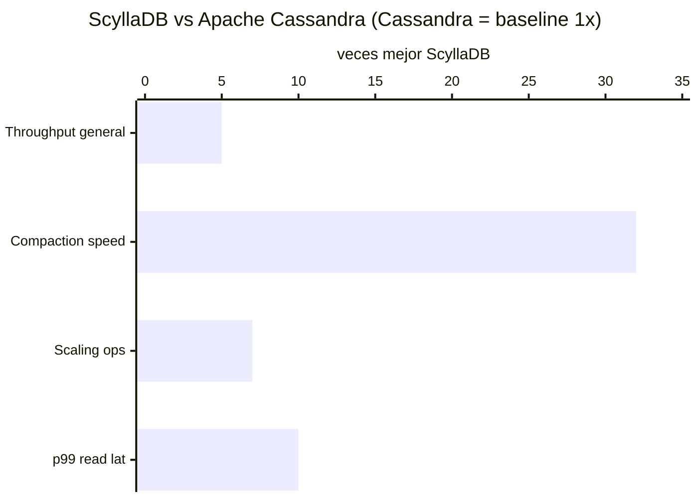

<div align="center">


# ScyllaDB

-orange?style=flat-square)
-red?style=flat-square)


**Técnicamente superior a Cassandra en todo. Pero eliminó su licencia open-source en diciembre 2024. Para nuevos proyectos OSS: usa Cassandra.**

</div>

---

## ⚡ Quick stats

| Atributo | Valor |
|---|---|
| Tipo | Wide-Column (NoSQL, Cassandra-compatible) |
| ACID | ❌ Eventual consistency (LWT para parcial) |
| Licencia | ⚠️ **Source-Available** (desde dic 2024) |
| Último release OSS | **v6.2** (AGPL, congelada) |
| Lanzamiento | 2015 |
| DB-Engines rank | #28 |
| Compatible con | Cassandra CQL (drop-in) |
| Arquitectura | C++ (sin JVM, sin GC) |

---

## ⚠️ Alerta de licencia (diciembre 2024)

```
Antes:   AGPL v3 ✅ (open source real)
Ahora:   Source-Available ❌ (no OSS, requiere licencia enterprise)
Último OSS:  v6.2 (congelada, sin actualizaciones de seguridad futuras)
```

**Implicaciones**:
- No puedes actualizar más allá de 6.2 sin pagar
- No puedes ofrecer ScyllaDB como servicio sin acuerdo comercial
- Nuevos proyectos open-source → **Apache Cassandra 5.x**

---

## 🏎️ Performance — aún el más rápido técnicamente



| Métrica | Apache Cassandra | ScyllaDB | Ventaja |
|---|---|---|---|
| Throughput general | baseline | **2x–5x mayor** | ScyllaDB |
| Cluster equivalente | 10 nodos | 1 nodo | ScyllaDB (10x menos nodos) |
| Costo por rendimiento | baseline | **2.5x más barato** | ScyllaDB |
| p99 insert latencia | 5–70ms | **5ms estable** | ScyllaDB |
| p99 read latencia | 40–125ms | **15ms** | ScyllaDB |
| Compaction | baseline | **32x más rápido** | ScyllaDB |
| Scaling operations | vNodes (lento) | **7.2x más rápido** (Tablets) | ScyllaDB |
| Licencia OSS | Apache 2.0 ✅ | Source-Available ❌ | **Cassandra** |

**Fuente**: [scylladb.com/benchmarks](https://www.scylladb.com/product/benchmarks/) + reportes de clientes

---

## 🧠 Por qué es más rápido

```
Cassandra:  Java + JVM → Garbage Collection pauses → latencia inconsistente
ScyllaDB:   C++ puro + Seastar framework → async shard-per-core
            Sin GC, sin JVM → latencias estables y predecibles

ScyllaDB procesa cada core con su propio shard:
Core 0 → Shard 0 → maneja subset de datos
Core 1 → Shard 1 → maneja subset de datos
... cero contención entre cores
```

---

## ✅ Cuándo tiene sentido aún

- Proyectos existentes en ScyllaDB v6.2 que no necesitan upgrade
- Equipos con **presupuesto enterprise** donde el throughput justifica el costo
- ScyllaDB Cloud managed (si el SLA lo requiere)

## ❌ Cuándo NO

- Nuevos proyectos que quieran OSS → Apache Cassandra 5.x
- Sin presupuesto enterprise para licencia
- Proyectos donde actualizaciones de seguridad futuras son críticas

---

## 💰 Precios

| Servicio | Free | Paid desde |
|---|---|---|
| **ScyllaDB Cloud** | ❌ | ~$0.42/hora (i4i.xlarge) |
| **ScyllaDB Enterprise** | ❌ | Custom (licencia) |
| **v6.2 OSS** | ✅ Gratis (congelada) | Riesgo sin updates |

---

## 🔀 Decisión 2025

```
Necesitas Cassandra-compatible + open-source → Apache Cassandra 5.x
Budget enterprise + máximo rendimiento      → ScyllaDB Enterprise
Proyectos existentes ScyllaDB <6.2          → Evalúa migración a Cassandra
                                               o upgrade a Enterprise
```

---

## 🔗 Links

- 📖 [Documentación oficial](https://docs.scylladb.com/)
- 🔀 [Migración ScyllaDB → Cassandra](https://cassandra.apache.org/_/blog.html)
- 📊 [ScyllaDB benchmarks (vendor)](https://www.scylladb.com/product/benchmarks/)
- 📰 [Anuncio cambio de licencia dic 2024](https://www.scylladb.com/2024/12/)

---

> [← README](../README.md)
