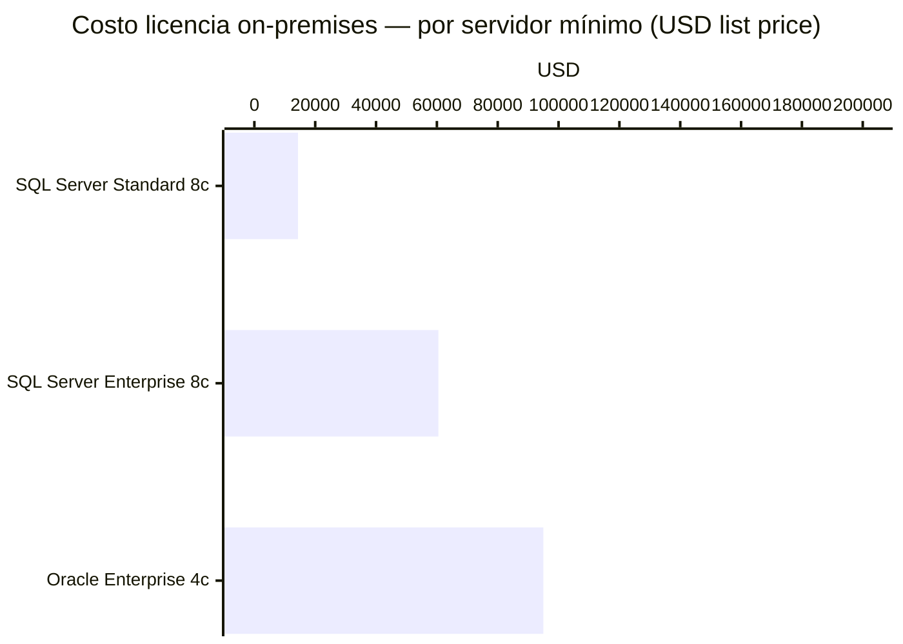

<div align="center">


# Microsoft SQL Server


-blue?style=flat-square)


**El relacional enterprise de Microsoft. Integración perfecta con Azure, .NET, y el ecosistema Windows. Caro on-premises, pero razonable en Azure. #3 mundial.**

</div>

---

## ⚡ Quick stats

| Atributo | Valor |
|---|---|
| Tipo | Relacional (SQL, T-SQL) |
| ACID | ✅ Completo |
| Licencia | Comercial (Microsoft) |
| Lanzamiento | 1989 |
| DB-Engines rank | **#3** (detrás de Oracle y MySQL) |
| Stack nativo | .NET / Azure / Windows Server |
| Query language | T-SQL (Transact-SQL) |
| Creador | Microsoft |

---

## ✅ Cuándo usarlo

- Stack .NET / C# / ASP.NET — integración nativa
- Empresa ya en ecosistema Microsoft / Azure
- BI y reporting (SSRS, SSAS, SSIS incluidos)
- Datos empresariales con cumplimiento regulatorio
- Azure SQL Database (managed, muy conveniente en Azure)
- Migración desde sistemas legacy Windows
- Stored procedures complejos en T-SQL

## ❌ Cuándo NO usarlo

- Proyectos open-source o startups sin presupuesto → PostgreSQL
- Stack Linux/Python/Node.js → PostgreSQL nativa mejor
- Fuera del ecosistema Microsoft sin razón particular
- Cuando el precio on-premises es prohibitivo

---

## 💰 Precios — On-Premises (list price 2025)



| Edición | Precio list | Notas |
|---|---|---|
| **Express** | **Gratis** | 10 GB max, sin HA, para desarrollo |
| **Developer** | **Gratis** | Completo, solo no producción |
| **Standard** | $3,586 / 2-core pack | Máx 24 cores, 128 GB RAM |
| **Enterprise** | $15,123 / 2-core pack | Mínimo 4 packs = **$60,492/servidor** |
| Software Assurance | 25–35%/año adicional | Actualizaciones y soporte |

> Nadie paga list price en enterprise — descuentos: 30–60% con EA/CSP.

---

## ☁️ Precios Azure SQL Database (managed)

| Tier | vCores | USD/mes aprox |
|---|---|---|
| **Free** (serverless) | 1 vCore | Gratis (32 GB storage) |
| **Basic** | — | $5/mes |
| **General Purpose S2** | 2 vCores | ~$75/mes |
| **Business Critical** | 4 vCores | ~$550/mes |
| **Serverless GP** | Auto 0.5–2 vCores | ~$0.365/vCore-hora |

> 💡 **Azure SQL Database Free Tier**: hasta 100K vCore-segundos de compute/mes, 32 GB storage — suficiente para proyectos personales.

---

## 📊 Performance

```
Lectura (sysbench, tuned):     ~85,000 TPS
Escritura:                     ~50,000 ops/seg
Latencia p50:                  ~2ms
Latencia p99:                  ~8ms
In-Memory OLTP:                Hasta 30x vs on-disk para workloads puntuales
Columnstore index:             Analytics hasta 10x más rápido
```

---

## 🔧 Features destacados

| Feature | SQL Server | PostgreSQL |
|---|---|---|
| In-Memory OLTP | ✅ Nativo (Hekaton) | ❌ (extensión) |
| Columnstore index | ✅ Enterprise/Standard | ✅ (cstore_fdw) |
| Always On AG | ✅ HA nativo | Requiere Patroni |
| SSRS / SSAS / SSIS | ✅ Suite completa BI | Herramientas externas |
| Azure integración | ✅ Native | Buena pero externa |
| T-SQL features | ✅ Window functions, CTE | ✅ Similar |

---

## 🎥 Tutoriales

### 🇺🇸 English
[](https://www.youtube.com/watch?v=7GVFYt6_ZFM)
[](https://www.youtube.com/watch?v=7S_tz1z_5bA)

### 🇪🇸 Español
[](https://www.youtube.com/watch?v=G3CL_yQIJiM)

### 🇨🇳 中文
[](https://www.bilibili.com/video/BV1UE411i7VA)

---

## 🔗 Links

- 📖 [Documentación oficial](https://learn.microsoft.com/en-us/sql/sql-server/)
- 🆓 [SQL Server Developer Edition (gratis)](https://www.microsoft.com/en-us/sql-server/sql-server-downloads)
- ☁️ [Azure SQL Database](https://azure.microsoft.com/en-us/products/azure-sql/database/)
- 🔧 [SSMS — SQL Server Management Studio](https://learn.microsoft.com/en-us/sql/ssms/)

---

> [← README](../README.md)
